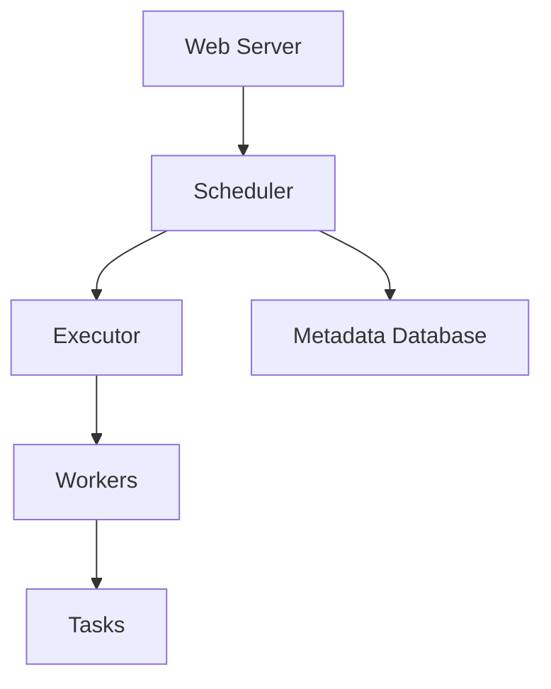

# Airflow Architecture

## ✅ Single-Node Setup
- All components on **one machine**
- Good for:
    - Development
    - Small workflows

---

## ✅ Multi-Node Setup
- Scheduler, workers, webserver, DB on separate machines
- Uses Celery or Kubernetes executor
- Scalable for production

---

## ✅ High-Level Architecture Diagram
