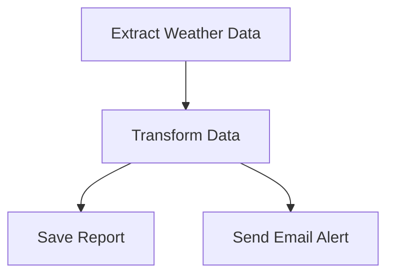

# Why Airflow?

## ✅ Real-World Scenario Without Airflow

**Imagine this…**
You’re a data engineer at a weather monitoring company. Your daily job:

- Every morning at 6 AM, fetch temperature data from an API.
- Clean the data (remove errors, missing values).
- Store it in a database.
- Send an alert email if the temperature crosses 40°C.

You write Python scripts:

- `fetch_data.py`
- `clean_data.py`
- `store_data.py`
- `send_alert.py`

### ❌ The Problems Without Airflow:
- How do you make sure they run **in the right order**?
- What if `fetch_data.py` fails — do others still run?
- How do you **schedule this every day at 6 AM**?
- Tomorrow your manager says:  
  *“Also fetch humidity, and do it every 15 minutes.”*  
  Suddenly your cron jobs become a nightmare:
    - Writing multiple cron jobs
    - Handling failures manually
    - Checking logs by hand
    - On-call at 2 AM when something breaks!

---

## ✅ How Airflow Solves This:
- Draw a **simple DAG** (Directed Acyclic Graph):
  Fetch → Clean → Store → Alert

- Airflow:
- Ensures correct order
- Retries failed steps
- Logs everything
- Schedules jobs
- Easy to **add new tasks** without breaking old ones
- **UI for visibility** – check status anytime

---

## ✅ Key Benefits (in simple terms):
- **Automation** – No manual runs
- **Reliability** – Handles failures and retries
- **Scalability** – Add steps without rewriting scripts
- **Visibility** – Track everything in the UI

---

## ✅ Discussion Question:
Where else would you need a system that runs **multiple steps in order, every day, without fail**?

Examples students might say:
- E-commerce order processing
- Bank transaction reconciliation
- Social media content scheduling
- Daily backup jobs

---

## ✅ DAG Visualization
